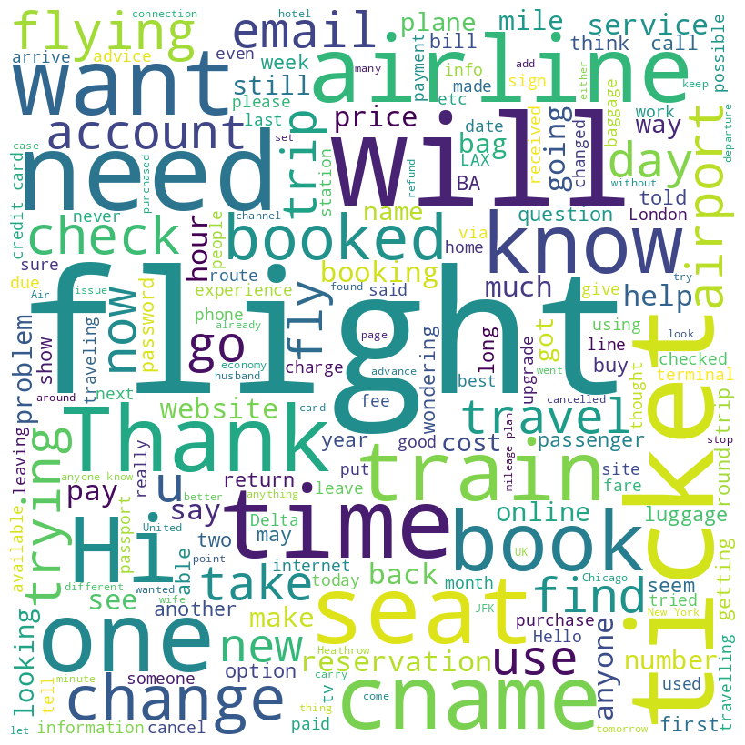
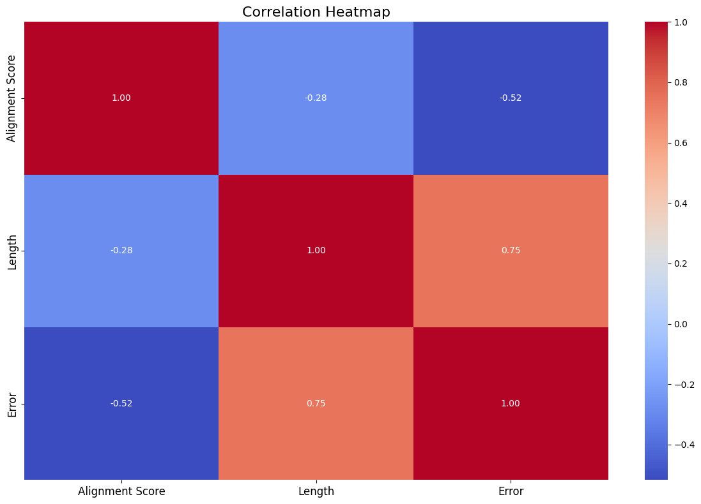

# PROJECT: IMPROVING RELATIONAL LANGUAGE UNDERSTANDING IN INTELLIGENT VIRTUAL AGENTS (IVAS)

## OVERVIEW

In order to promote more efficient and natural human-agent interactions, this project aims to improve Intelligent Virtual Agents' (IVAs') relational language understanding skills. The goal of this project is to enhance the overall user experience and empower intelligent assistants (IVAs) to execute tasks more accurately and efficiently by enhancing their capacity to understand complex relationships expressed in language.

## BUSINESS UNDERSTANDING

Intelligent virtual agents (IVAs) are vital in various applications,including virtual assistants and customer service chatbots.However, their effectiveness is limited by challenges inunderstanding complex human language. This project seeks to bridge the gap between machine comprehension and human communication.

### Problem statement

When interacting with customers, existing Intelligent Virtual Agents (IVAs) often find it difficult to decipher and react correctly to relational language cues. This shortcoming impairs customer satisfaction and experiences, as well as the IVAs' ability to build rapport, effectively handle customer needs, and cultivate positive relationships. Thus, there is a pressing need for processes and instruments that enable IVAs to recognise and react to relational language cues with precision, improving the calibre of customer service encounters and increasing customer satisfaction levels.

### Objectives

Our objectives include:
1.Develop algorithms and models to enable IVAs to comprehend relational language expressions comprehensively, including complex relationships and subtle nuances. (MAIN)
2.Enhance IVAs' ability to understand relational language in various contexts, adapting their interpretations based on the specific scenario and user intent.
3.Optimize the computational efficiency of the relational language understanding models to ensure real-time responsiveness of IVAs during interactions.

## DATA UNDERSTANDING AND PREPARATION

The RSiCS dataset was collected from commercial customer service IVAs and the TripAdvisor airline forum (https://nextit-public.s3-us-west-2.amazonaws.com/rsics.html). It comprised four files, originating from commercial customer service IVAs and the TripAdvisor airline forum. The first file, "x_y_align.csv," details alignment and agreement metrics between two annotators (A and B) within a group for specific requests. It includes columns such as Annotator IDs, Group ID, Dataset ID, Request ID, original text, annotated texts, length, error, alignment score, and agreement. The second file, "all_data_by_threshold.csv," merges selections and determines user intentions based on thresholds, including columns for Dataset ID, Group ID, Request ID, MultiIntent flag, threshold, merged selections, unselected and selected texts, and removed text percentage. The third file, "tagged_selections_by_sentence.csv," identifies relational language in user requests with columns like Dataset ID, Group ID, Request ID, threshold, merged selections, selected and unselected texts, and flags for various linguistic features like greeting, backstory, justification, rant, gratitude, among others. Finally, the "all_multi_intent.csv" file flags requests with multiple intentions, containing Dataset ID, Group ID, Request ID, original text, and flags from annotators regarding the presence of multiple intents. This comprehensive dataset allows for in-depth analysis of user intents, agreement between annotators, and linguistic features in customer service interactions and forum posts.

## DATA ANALYSIS

### Univariate analysis

A word cloud visualization to represent the frequency of words in the text data, providing a quick and visually appealing way to understand the most common words in the text.

### Bivariate Analysis

A heatmap to visualize the correlation between pairs of numerical variables (Alignment Score, Length, and Error). 
 

## MODELING

RASA was used for modelling and the following files utilized

1. NLU.yml - Contains training data for the Natural Language Understanding (NLU) model, including examples of user messages labelled with intents and entities.
2. Config.yml- specifies the configuration for the machine learning models used in the Rasa project, including settings for the NLU and dialogue management components.
3. stories.yml - Defines conversational flows by mapping out sequences of user inputs (intents) and corresponding bot responses. It's a collection of example conversations.
4. Domain. yml - defines the domain of the assistant, including intents, entities, actions, responses, and slots. It essentially outlines what the assistant can understand and do.
5. credentials.yml - Stores credentials and connection information for external services that the assistant interacts with, such as databases, APIs, or messaging platforms.
6. actions.py - Defines custom actions that the bot can perform, such as calling APIs, querying databases, or executing specific tasks based on user requests.
7. rules.yml - Contains rules for defining specific conversation paths or behaviours based on predefined conditions. These rules can help guide the dialogue in certain situations.
8. endpoints.yml - Specifies the endpoints for the Rasa project, including the location of the model server and other services like the action server and tracker store.

## CONCLUSION

In summary, the development of algorithms and models to enhance
relational language understanding in Intelligent Virtual Agents (IVAs)
signifies significant progress in improving human-computer interactions.
Our efforts enable IVAs to comprehend complex relationships, adapt to
various contexts, and respond in real-time, enhancing interaction quality
and effectiveness.

## NEXT STEPS

1. Model Fine-tuning: Continue fine-tuning the models on additional datasets to further improve their performance and adaptability to diverse contexts.
2. Integration of Multimodal Inputs: Explore the integration of multimodal inputs, such as text, speech, and visual cues, to enhance the understanding of relational language and enrich user interactions.
3. Continuous Monitoring and Feedback: Implement mechanisms for continuous monitoring of IVA interactions and gathering user feedback to iteratively refine the models and enhance user satisfaction.
4. Collaboration with Domain Experts: Collaborate with domain experts to incorporate domain-specific knowledge and refine the models' understanding of relational language within specific domains.
